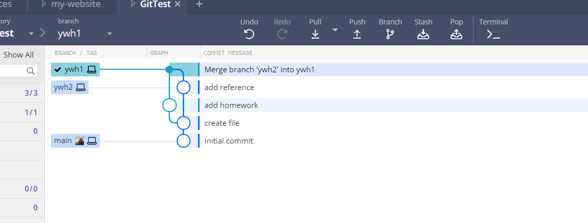

# GitTest

## Requirements

1. 注册Github账号
  
2. Fork [KVM-Explorer/GitTest (github.com)](https://github.com/KVM-Explorer/GitTest)到自己的个人仓库
  
3. Clone Repo到本地
  
4. 创建并切换新的分支zs1，并将其命名为姓名首字母缩写如张三zs.md
  
5. 在工作区创建自己名字缩写的文件夹
  
6. 添加一个空白Markdown文件并追踪，文件名为姓名缩写如zs.md，提交**第一次commit**
  
7. 将本次作业要求复制到该文档后提交**第二次commit**
  
8. 在第一次提交的节点新建分支zs2，要求同上
  
9. 在新的分支将推荐资料复制，完成**第三次commit**
  
10. 将zs2分支合并到zs1分支，解决文件冲突后，合并后基本如下图所示

  
11. 将当前仓库内容push到远程仓库，基于自己repo向[KVM-Explorer/GitTest (github.com)](https://github.com/KVM-Explorer/GitTest)发起Pull Request请求，完成作业提交